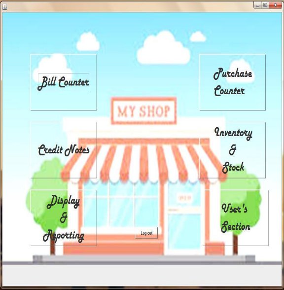
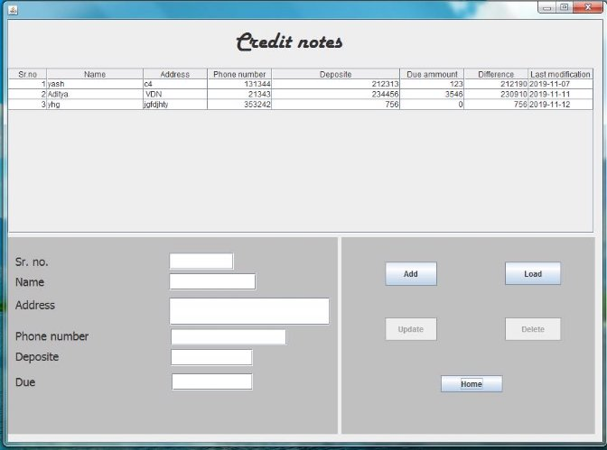

S.V.M. PUBLIC SCHOOL Jaipur 

A Project Report on 

*Departmental Store Management System* 

For                        AISSCE2019-20 Examination 

[As a part of the Informatics Practices Course]

SUBMITTED BY 

Yash Natani  

Under the Guidance of: ***Mrs. Chitra Sehgal*** 

**CERTIFICATE** 

This  is  to  certify  that  the  Project  /  Dissertation  entitled Departmental  Store   Management  System  is  a  bonfire  work done by Master Yash Natani of class XII ‘Science’ Session 2019- 20 in partial fulfillment of CBSE’s AISSCE Examination2019- 20 and has been carried out under my direct supervision and guidance. This report or a similar report on the topic has not been submitted for any other examination and does not form a part of any other course undergone by the candidate. 

**…………………………    …………………………….. Signature of Student      Signature of Teacher/Guide {Yash Natani}           {Mrs. Chitra Sehgal}** 

**Roll No.:**  

**Place: Jaipur**                        **Signature of Principal Date:**                                            

**ACKNOWLEDGEMENT** 

undertook this Project work, as the part of my XII-Informatics Practices I

course. I had tried to apply my best of knowledge and experience, gained 

during  the  study  and  class  work  experience.  However,  developing software system is generally a quite complex and time-consuming process. It requires a systematic study, insight vision and professional approach during the design and development. Moreover, the developer always feels the need, the help and good wishes of the people near you, who have considerable experience and idea. 

I would like to extend my sincere thanks and gratitude to my teacher Mrs. Chitra Sehgal. I am very much thankful to our Principal  for giving valuable time and moral support to develop this software.  

I  would  like  to  take  the  opportunity  to  extend  my  sincere  thanks  and gratitude to my father Mr. Kamlesh Natani and my mother Mrs. Alka Natani for being a source of inspiration and providing time and freedom to develop this software project.  

I  also  feel  indebted  to  my  friends  Master  Aditya  Fulluke  and  Master Divyanshu Sharma  for the valuable suggestions during the project work. 

`         `Yash Natani  

`                          `Class XII Science-Maths 

**C O N T E N T S** 

1. Introduction ---------------------------------------------------------------------------- 5 
1. Objective & Scope of the Project -------------------------------------------- 6 
1. Theoretical Background --------------------------------------------------------- 8 
1. Problem Definition & Analysis --------------------------------------------- 13 
1. System Implementation -------------------------------------------------------- 14 
   1. The Hardware used: ------------------------------------------------------ 114 
   1. The Softwares used: ------------------------------------------------------- 114 
1. System Design & Development -------------------------------------------- 15 

   2. Database Design: -------------------------------------------------------------- 15 6.3I/O Forms Design & Event Coding:---------------------------------- 17 
1. User Manual ------------------------------------------------------------------------- 59 
   1. How to install:  ----------------------------------------------------------------- 59 
1. References  ---------------------------------------------------------------------------- 60 
1. **Introduction** 

This software project is developed to automate the functionalities of a Departmental Store. The purpose of the software project is to develop the Management Information System (MIS) to automate the record of the products, purchase, sales, billing, account, customers , users  with a view to enhance the decision making  of the functionaries.  

A MIS mainly consists of a computerized database, a collection of inter- related tables for a particular subject or purpose, capable to produce different reports relevant to the user. An application program is tied with the database for easy access and interface to the database. Using Application program or front-end, we can Departmental Store owner’s, retrieve and manage all information in proper way.  

This software, being simple in design and working, does not require much of training to users, and can be used as a powerful tool for automating a Store System. 

During coding and design of the software Project, Java NetBeans IDE, a powerful front-end tool is used for getting Graphical User Interface (GUI) based integrated platform and coding simplicity. As a back-end a powerful, open source RDBMS, My SQL is used as per requirement of the CBSE curriculum of Informatics Practices Course.  

2. **Objective & Scope of the Project  **

T he objective of the software project is to develop a computerized MIS to automate the functions of a Store. This software project is 

also aimed to enhance the current record keeping system, which will help managers to retrieve the up-to-date information at right time in right 

shape. 

The proposed software system is expected to do the following functionality- 

- To provide a user friendly, Graphical  User Interface (GUI) based integrated and centralized environment for MIS activities.   
- The  proposed  system  should  maintain  all  the  records  and  should generate the required reports and information when required. 
- To  provide  graphical  and  user-friendly  interface  to  interact  with  a centralized database based on client-server architecture. 
- To  identify  the  critical  operation  procedure  and  possibilities  of simplification using modern IT tools and practices. 

In its current scope, the software enables user to retrieve and update the information from centralized database designed with MySQL . This software does not require much training time of the users due to limited functionality and simplicity. 

During the development of Store management System project, Java NetBeans IDE, a powerful, open source event-driven form-based development environment is used for modular design and future expandability of the system. 

Despite of the best effort of the developer, the following limitations and functional boundaries are visible, which limits the scope of this application software. 

1. This software can have Departmental Store records in pre-designed format in soft copy. There is no facility yet to produce customized reports. Only specified reports are covered.  
1. There is no provision to calculate fine or penalty etc. for defaulter members; however it can be developed easily with the help of adding modules*.*  

So far as future scope of the project is concerned, firstly it is open to any modular expansion i.e. other modules or functions can be designed and embedded to handle the user need in future. Any part of the software and reports can be modified independently without much effort.  

3. **Theoretical Background **
1. What is Database? Introduction and Concepts: 

A database is a collection of information related to a particular subject or purpose, such  as  tracking  customer  orders  or  maintaining  a  music  collection.  Using  any RDBMS application software like MS SQL Server, MySQL, Oracle, Sybase etc, you can manage all your information from a single database file. Within the file, divide your data into separate storage containers called tables. You may and retrieve the data using queries.  

A table is a collection of data about a specific topic, such as products or suppliers. Using a separate table for each topic means you can Departmental Store  that data only once, which makes your database more efficient and reduces data-entry errors. Table organises data into columns (called fields) and rows (called records).  

A Primary key is one or more fields whose value or values uniquely identify each record in a table. In a relationship, a primary key is used to refer to specific record in one table from another table. A primary key is called foreign key when it is referred to from another table.  

To find and retrieve just the data that meets conditions you specify, including data from  multiple  tables,  create  a  query.  A  query  can  also  update  or  delete  multiple records at the same time, and perform built-in or custom calculations on your data. 

Role of RDBMS Application Program:  

A computer database works as a electronic filing system, which has a large number of ways of cross-referencing, and this allows the user many different ways in which to re- organize and retrieve data. A database can handle business inventory, accounting and filing and use the information in its files to prepare summaries, estimates and other reports. The management of data in a database system is done by means of a general- purpose  software  package  called  a  Database  Management  System  (DBMS).  Some commercially  available  DBMS  are  MS  SQL  Server,  MS  ACCESS,  INGRES, ORACLE, and Sybase. A database management system, therefore, is a combination of hardware and software that can be used to set up and monitor a database, and can manage the updating and retrieval of database that has been Departmental Store d in it. Most of the database management systems have the following capabilities: 

- Creating of a table, addition, deletion, modification of records. 
- Retrieving data collectively or selectively. 
- The data Departmental Store d can be sorted or indexed at the user's discretion and direction. 
- Various  reports  can  be  produced  from  the  system.  These  may  be  either standardized report or that may be specifically generated according to specific user definition. 
- Mathematical functions can be performed and the data Departmental Store d in the database can be manipulated with these functions to perform the desired calculations. 
- To maintain data integrity and database use. 

The DBMS interprets and processes users' requests to retrieve information from a database.  In  most  cases,  a  query  request  will  have  to  penetrate  several  layers  of software  in  the  DBMS  and  operating  system  before  the  physical  database  can  be accessed. The DBMS responds to a query by invoking the appropriate subprograms, each of which performs its special function to interpret the query, or to locate the desired data in the database and present it in the desired order.  

2. What is My SQL  ?                                                                                   

The  management  of  data in a  database  system  is  done by  means  of  a  general- purpose software package called a Database Management System (DBMS). Some commercially available RDBMS are MS SQL Server, MS ACCESS, INGRES, ORACLE, and Sybase.  

MySQL,  the  most  popular  Open  Source  SQL  database  management  system,  is developed, distributed, and supported by Oracle Corporation. MySQL is named after co-founder Monty Widenius's daughter, My. The name of the MySQL Dolphin (our logo) is “Sakila”.  

- **MySQL is a database management system.**  

A database is a structured collection of data. It may be anything from a simple shopping  list  to  a  picture  gallery  or  the  vast  amounts  of  information  in  a corporate network. To add, access, and process data Departmental Store d in a computer database, you need a database management system such as MySQL Server. Since  computers  are  very  good  at  handling  large  amounts  of  data, database management systems play a central role in computing, as standalone utilities, or as parts of other applications.  

- **MySQL is based on SQL.**  

A relational database Departmental Store’s data in separate tables rather than putting all the data in one big Departmental Store room. This adds speed and flexibility.  The  SQL  part  of  “MySQL”  stands  for  “Structured  Query Language.” SQL is the most common standardized language used to access databases and is defined by the ANSI/ISO SQL Standard. The SQL standard has been evolving since 1986 and several versions exist. In this manual, “SQL- 92” refers to the standard released in 1992, “SQL:1999” refers to the standard released in 1999, and “SQL:2003” refers to the current version of the standard.  

- **MySQL software is Open Source.**  

Open  Source  means  that  it  is  possible  for  anyone  to  use  and  modify  the software. Anybody can download the MySQL software from the Internet and use it without paying anything. If you wish, you may study the source code and change it to suit your needs. The MySQL software uses the GPL (GNU General Public License),  

- **The MySQL Database Server is very fast, reliable, and easy to use.**  

If that is what you are looking for, you should give it a try. MySQL Server also has a practical set of features developed in close cooperation with our users. You can find a performance comparison of MySQL Server with other database managers on our benchmark page. MySQL Server was originally developed to handle  large  databases  much  faster  than  existing  solutions  and  has  been successfully used in highly demanding production environments for several years. Although under constant development, MySQL Server today offers a rich and useful set of functions. Its connectivity, speed, and security make MySQL Server highly suited for accessing databases on the Internet.  

- **MySQL Server works in client/server or embedded systems.**  

The MySQL Database Software is a client/server system that consists of a multi-threaded SQL server that supports different back ends, several different client  programs  and  libraries,  administrative  tools,  and  a  wide  range  of application programming interfaces (APIs).  

**The Main Features of MySQL** 

- Written in C and C++.  
- Works on many different platforms.  
- Uses multi-layered server design with independent modules.  
- Provides transactional and no transactional storage engines.  
- Designed to make it relatively easy to add other storage engines. This is useful if you want to provide an SQL interface for an in-house database.  
- Uses a very fast thread-based memory allocation system.  
- Executes very fast joins using an optimized nested-loop join.  
- Implements SQL functions using a highly optimized class library that should be as fast as possible. Usually there is no memory allocation at all after query initialization.  
- Password security by encryption of all password traffic when you connect to a server.  
- Support for large databases. We use MySQL Server with databases that contain 50 million records. We also know of users who use MySQL Server with 200,000 tables and about 5,000,000,000 rows.  
- MySQL client programs can be written in many languages. A client library written in C is available for clients written in C or C++, or for any language that provides C bindings.  
- APIs for C, C++, Eiffel, Java, Perl, PHP, Python, Ruby, and Tcl are available, enabling MySQL clients to be written in many languages.  
- The Connector/ODBC (MyODBC) interface provides MySQL support for client programs that use ODBC (Open Database Connectivity) connections.  
- The Connector/J interface provides MySQL support for Java client programs that use JDBC connections. Clients can be run on Windows or Unix. Connector/J source is available. 
3. ***What is NetBeans IDE ?*** 

NetBeans started as a student project (originally called Xelfi) in the Czech Republic in 1996. The goal was to write a Delphi-like Java IDE in Java. Xelfi was the first Java IDE (Integrated Development Environment) written in Java, with its first pre- releases in 1997. Xelfi was a fun project to work on, especially since Java IDE space was uncharted territory at that time. The project attracted enough interest that these students, once they graduated, decided that they could market it as a commercial product. Soliciting resources from friends and relatives for a web space, they formed a company around it. 

Soon after, they were contacted by[ Roman Stanek,](http://www.google.com/search?q=roman+stanek&hl=en&lr=&c2coff=1&client=safari&rls=en&start=10&sa=N) an entrepreneur who had already been involved in several startups in the Czech Republic. He was looking for a good idea to invest in, and discovered Xelfi. He met with the founders; they hit it off, and a business was born.  

In the spring of 1999,[ NetBeans DeveloperX2 ](http://www.internetnews.com/dev-news/article.php/75561)was released, supporting Swing. The performance improvements that came in JDK 1.3, released in the fall of 1999, made NetBeans a viable choice for development tools. By the summer of 1999, the team was hard at work re-architecting DeveloperX2 into the more modular NetBeans that forms the basis of the software today.  

Something else was afoot in the summer of 1999: [Sun Microsystems ](http://www.sun.com/)wanted better Java development tools, and had become interested in NetBeans. It was a dream come true for the NetBeans team: NetBeans would become the flagship tool set of the maker of Java itself! By the Fall, with the next generation of NetBeans Developer in  beta,  a  deal  was  struck.  Sun  Microsystems  had  also  acquired  another  tools company, During the acqusition, the young developers who had been involved in open-source projects for most of their programming careers, mentioned the idea of open-sourcing NetBeans. Fast forward to less than six months later, the decision was made that NetBeans would be open sourced. While Sun had contributed considerable amounts  of  code  to  open  source  projects  over  the  years,  this  was  Sun's  first *sponsored* open source project, one in which Sun would be paying for the site and handling the infrastructure.  

**Features of NetBeans** 

A free, open-source Integrated Development Environment for software developers. You get all the tools you need to create professional desktop, enterprise, web, and mobile applications with the Java platform, as well as C/C++, PHP, JavaScript, Groovy, and Ruby. NetBeans IDE 6.9 introduces the JavaFX Composer, support for JavaFX SDK 1.3, OSGi interoperability, support for the PHP Zend framework and Ruby on Rails 3.0, and more.

4. **Problem Definition & Analysis **

The hardest part of building a software system is deciding precisely what to build. No other part of the conceptual work is so difficult as establishing the detailed technical requirement. Defining and applying good, complete requirements are hard to work, and success in this endeavor has eluded many of us. Yet, we continue to make progress. 

Problem definition describes *what* of a system, not *how*. The quality of a software product is only as good as the process that creates it. Problem definition is one of the  most  crucial  steps  in  this  creation  process.  Without  defining  a  problem, developers do not know what to build, customers do not know what to expect, and there is no way to validate that the built system satisfies the requirement.  

Problem definition and Analysis is the activity that encompasses learning about the problem to be solved, understanding the needs of customer and users, trying to find out who the user really is, and understanding all the constraints on the solution. It includes all activities related to the following: 

- Identification and documentation of customer’s or user’s needs. 
- Creation  of  a  document  that  describes  the  external  behavior  and  the association constraints that will satisfies those needs. 
- Analysis and validation of the requirements documents to ensure consistency, completeness, and feasibility 
- Evolution of needs. 

After the analysis of the functioning of a Departmental Store  Management System, the proposed System is expected to do the following: - 

- To provide a user friendly, Graphical User Interface (GUI) based integrated and  centralized  environment  for  computerized  Departmental  Store Management System.   
- The proposed system should maintain all the records and transactions, and should generate the required reports and information when required. 
- To provide graphical and user-friendly interface to interact with a centralized database based on client-server architecture. 
- To identify the critical operation procedure and possibilities of simplification using modern IT tools and practices. 
5. **System Implementation **
1. ***The Hardware used:***  

While developing the system, the used hardware are: 

PC with Intel(R) Core(TM)i3 (@2.93GHz) processor having 2.00 GB RAM, SVGA and other required devices.  

2. ***The Softwares used:*** 
- Microsoft Windows® XP as Operating System. 
- Java NetBeansIDE 6.5.1 as Front-end Development environment. 
- MySQL as Back-end Sever with Database for Testing. 
- MS-Word 2007 for documentation. 
6. **System Design & Development **
1. ***Database Design:*** 

An important aspect of system design is the design of data storage structure. To begin with a logical model of data structure is developed first. A database is a container object which contains tables, queries, reports and data validation policies enforcement rules or constraints etc. A logical data often  represented  as  a  records  are  kept  in  different  tables  after  reducing  anomalies  and redundancies. The goodness of data base design lies in the table structure and its relationship. This software project maintains a database named **ds** which contains the following tables.  

**Table Design:** 

The  database  of  Departmental  Store  Management  System  contains  5  tables.  The  tables  are normalized  to  minimize  the  redundancies  of  data  and  enforcing  the  validation  rules  of  the organization. Most of the tables are designed to Departmental Store   master records. The tables and their structure are given below.  

**Table: Inventory** 

||*Column Name* |*Type* ||*Size* |
| :- | - | - | :- | - |
||**P\_id   (Primary Key)** |Integer ||4 |
||Dis |Varchar ||100 |
||CP |Integer ||10 |
||SP |Integer ||10 |
||In\_stock |Integer ||10 |
||Trader |Varchar ||40    |
||S\_Group |Varchar ||20 |
|||||
|**Table:  User** ||||
|*Column Name* |*Type* ||*Size* |
|Name |Varchar ||30 |
|**User\_name(Primary Key)** |Varchar ||20 |
|Email |Varchar ||90 |
|Password |Varchar ||20 |
|||||
**Table: Purchase** 

|*Column Name* |*Type  Size* |
| - | - |
|**Sr\_No(Primary Key)**                                    |Integer                                               4 |
|**             P\_id**   |Integer     4 |
|Dis |Varchar  100 |
|CP |Integer  10 |
|SP |Integer  10 |
|Quantity |Integer  10 |
|Trader |Varchar  40    |
|S\_Group |Varchar  20 |
|P\_Date |Date |
|||||
|||||
|**Table:  Credit** ||||
||*Column Name* |*Type* ||*Size* |
||**Sr\_No(Primary Key)** |Integer ||10 |
||Name  |Varchar ||` `50 |
||Address  |Varchar ||` `200 |
||P\_no |Integer ||12 |
||Amount\_Dip |Integer ||10 |
||Amount\_due |Integer ||10 |
||U\_date |date |||
|**Table: Sales** ||||
|*Column Name* |*Type* ||*Size* |
|**Sr\_No(Primary Key)** |Integer ||5 |
|Customer |Varchar ||50 |
|class |Varchar ||10 |
|Date |Date |||
2. ***I/O Forms Design & Event Coding:*** 

The software project for Store Management contains various forms along with programming codes. Forms (JFrames) and their event coding are given below. 

Coding for Imports & Public class:- 

import java.awt.\*; 

import java.sql.\*; 

import javax.swing.JOptionPane; 

import javax.swing.table.DefaultTableModel; 

import java.util.Date; 

import java.text.SimpleDateFormat; 

import java.util.TimeZone; 

import org.jfree.chart.\*; 

import org.jfree.chart.plot.CategoryPlot; 

import org.jfree.chart.plot.PlotOrientation; 

import org.jfree.data.category.DefaultCategoryDataset; 

/\*\* 

` `\* 

\* @author Admin  \*/ 

public class Login\_frame extends javax.swing.JFrame {     Connection x = null; 

`    `Statement y = null; 

`    `ResultSet z = null; 

/\*\* Creates new form Login\_frame \*/ 

`       `public Login\_frame() { 

`        `initComponents(); 

1. Frame:  Login\_frame 

Coding for Sign Up Button (          )

`         `this.setVisible(false); 

`        `Signup\_frame.setVisible(true);         ps.setEchoChar((char) 0); 

`        `pcs.setEchoChar((char) 0); 

Coding for Login Button (          )   :- 

` `String a = un.getText(); 

` `String b = new String(p.getPassword()); 

` `if (a.equals("")) { 

` `JOptionPane.showMessageDialog(null, "Please Enter User Name  !"); 

`                              `} 

else { if (b.equals("")) { 

`                                                   `JOptionPane.showMessageDialog(null, "Please Enter password  !"); 

`                                         `} 

`           `else { 

`                       `try { 

`     `Class.forName("java.sql.Driver"); 

`     `x = DriverManager.getConnection("jdbc:mysql://localhost/ds", "root", "yash");      y = x.createStatement(); 

`                                 `String Q = "select\*from user where User\_name='" + un.getText() + "';"; 

`      `z = y.executeQuery(Q); 

`      `if (z.next()) { 

`                `String q = z.getString("Password"); 

`                `if (b.equals(q)) { 

`     `this.setVisible(false); 

`                                  `Home.setVisible(true); 

` `} 

else { 

JOptionPane.showMessageDialog(null, "Please Enter correct password  !")   

`                                                                    `}  

`        `else { 

`                                                  `JOptionPane.showMessageDialog(null, "No such user name found"); 

`                                               `} 

`                                    `}  

`         `catch (Exception K) { 

`                                                            `JOptionPane.showMessageDialog(null, K.getMessage()); 

`                                                           `}   }   } 

Coding for View Button (          )   :- 

`  `**MousePressed** 

`                              `{ p.setEchoChar((char) 0);   }                                      **MouseReleased** 

`                                `{p.setEchoChar('\u2022');} 

2. Frame:  Signup\_fram 

Coding for Sign up Button (     )   :- 

`       `String a = fn.getText(); 

`        `String b = ln.getText(); 

`        `String c = e.getText(); 

`        `String d = new String(ps.getPassword()); 

`        `String m = new String(pcs.getPassword());         int l = d.length(); 

`        `if (a.equals("") || a.equals("Name")) { 

`            `JOptionPane.showMessageDialog(null, "Please Enter Name ! "); 

`        `} else { 

`            `if (b.equals("") || b.equals("User Name")) { 

`                `JOptionPane.showMessageDialog(null, "Please Enter User Name  !"); 

`            `} else { 

`                `if (c.equals("") || c.equals("Email")) { 

`                    `JOptionPane.showMessageDialog(null, "Please Enter Email !"); 

`                `} else { 

`                    `if (d.equals("") || d.equals("Password")) { 

`                        `JOptionPane.showMessageDialog(null, " Please Enter Password !"); 

`                    `} else { 

`                        `if (m.equals("") || m.equals("Confirm Password")) { 

`                            `JOptionPane.showMessageDialog(null, " Please Confirm Password !"); 

`                        `} else { 

`                            `if (cb1.isSelected() == false) { 

`                                `JOptionPane.showMessageDialog(null, "Please accept T&C! "); 

`                            `} else { 

`                                `if (l < 8) { 

`                          `JOptionPane.showMessageDialog(null, " Please Enter Password with 8 charaters!! !");                                 } else { 

`                                    `if (d.equals(m)) { 

`                                        `try { 

`                                           `Class.forName("java.sql.Driver"); 

`                                     `x = DriverManager.getConnection("jdbc:mysql://localhost/ds", "root", "yash"); 

`                                            `y = x.createStatement(); 

`                                            `String s = "select\*from user where User\_name='" + b + "';"; 

`                                            `z = y.executeQuery(s); 

`                                            `if (z.next()) { 

`                                                `JOptionPane.showMessageDialog(null, "User name already exist"); 

`                                            `} else { 

`                                             `String Q = "Insert into user values ('" + a + "','" + b + "','" + c + "','" + d + "');";                                                 y.executeUpdate(Q); 

`                                                `JOptionPane.showMessageDialog(null, "signed up,please login"); 

`                                                `Signup\_frame.setVisible(false); 

`                                                `new Login\_frame().setVisible(true); 

`                                            `} 

`                                        `} catch (Exception K) { 

`                                            `JOptionPane.showMessageDialog(null, K.getMessage()); 

`                                        `} 

`                                    `} else { 

`                                        `JOptionPane.showMessageDialog(null, "Password not match");                                     } 

`            `}  }  } }  } }   } 

Coding for Sign up Button (     )   :- 

Signup\_frame.setVisible(false); 

`      `new Login\_frame().setVisible(true); 

Coding for Text fields:- 

fn Mouse Clicked 

`                       `{             fn.setText("");            }                                

ln  MouseClicked  

`                        `{             ln.setText();             }                                

`  `e  MouseClicked  

`                         `{            e.setText("");             }                               

` `ps MouseClicked 

`                          `{              ps.setText(""); 

`                                        `ps.setEchoChar('\u2022');        }                                pcs MouseClicked 

`                         `{            pcs.setText(""); 

`                                      `pcs.setEchoChar('\u2022');       }                                

3. Frame:  Home 

Coding for Bill Counter tab :- 

Home.setVisible(false); 

`        `Bill\_Counter.setVisible(true); 

`  `SimpleDateFormat dat = new SimpleDateFormat("yyyy-MMM-dd ");         dat.setTimeZone(TimeZone.getTimeZone("IST")); 

`        `dt.setText(dat.format(new Date())); 

`      `try { 

`            `Class.forName("java.sql.Driver"); 

`            `x = DriverManager.getConnection("jdbc:mysql://localhost/ds", "root", "yash");             y = x.createStatement(); 

`            `String q = "Select\*from sales ;"; 

`            `z = y.executeQuery(q); 

`            `int a = 0; 

`            `while (z.next()) { 

`                `a = Integer.parseInt(z.getString(1)); 

`            `} 

`            `a = a + 1; 

`            `bno.setText("" + a); 

`        `} catch (Exception K) { 

`            `JOptionPane.showMessageDialog(null, K.getMessage());         } 

Coding for Purchase Counter tab :- 

`        `Home.setVisible(false); 

`        `Purchase\_Counter.setVisible(true); 

`        `DefaultTableModel m = (DefaultTableModel) tb2.getModel(); 

`  `try { 

`           `Class.forName("java.sql.Driver"); 

`            `x = DriverManager.getConnection("jdbc:mysql://localhost/ds", "root", "yash"); 

`            `y = x.createStatement(); 

`            `String q = "select \*from purchase;"; 

`            `z = y.executeQuery(q); 

`            `while (z.next()) { 

`       `m.addRow(new Object[]{ z.getInt(1), z.getString(2), z.getInt(3), z.getInt(4), z.getInt(5), z.getString(6),    

z.getString(7),           z.getDate(8), z.getInt(9)})     } 

`            `String r = "select Dis from inventory;"; 

`            `ResultSet z1 = y.executeQuery(r); 

`            `while (z1.next()) { 

`                `pc2.addItem("" + z1.getString(1) + ""); 

`            `} 

`             `String t = "select distinct s\_Group from inventory;"; 

`            `ResultSet z2 = y.executeQuery(t); 

`            `while (z2.next()) { 

`                `pc6.addItem("" + z2.getString(1) + ""); 

`            `} 

`   `} catch (Exception K) { 

`            `JOptionPane.showMessageDialog(null, K.getMessage());                                       } 

`        `jLabel40.setVisible(false); 

`        `pc8.setVisible(false); 

`        `int sr = tb2.getRowCount(); 

`        `if (sr == 0) { 

`            `p1.setText("1"); 

`        `} else { 

`            `sr = sr - 1; 

`            `int pr = Integer.parseInt(m.getValueAt(sr, 8).toString());             pr = pr + 1; 

`            `pl.setText("" + pr); 

`        `} 

`        `bd1.setEnabled(false); 

`        `pc1.setText("");         pc3.setText("");         pc5.setText("");         pc4.setText("");         pc7.setText(""); 

Coding for Credit Notes tab :- Home.setVisible(false); 

`        `Credit\_note.setVisible(true); 

SimpleDateFormat dat = new SimpleDateFormat("yyyy-MM-dd "); dat.setTimeZone(TimeZone.getTimeZone("IST")); 

String o = dat.format(new Date()); 

DefaultTableModel m = (DefaultTableModel) tb.getModel(); 

`        `try { 

`            `Class.forName("java.sql.Driver"); 

`            `x = DriverManager.getConnection("jdbc:mysql://localhost/ds", "root", "yash");             y = x.createStatement(); 

`            `String q = "select \*from credit;"; 

`            `z = y.executeQuery(q); 

`            `while (z.next()) { 

`                `int c = z.getInt(5); 

`                `int d = z.getInt(6); 

`                `int a = c - d; 

`                `m.addRow(new Object[]{ 

`                            `z.getInt(1), z.getString(2), z.getString(3), z.getInt(4), z.getInt(5), z.getInt(6), a, z.getDate(7)});             } 

`        `} catch (Exception K) { 

`            `JOptionPane.showMessageDialog(null, K.getMessage());         } 

`        `t1.setText(""); 

`        `t2.setText(""); 

`        `t3.setText(""); 

t4.setText(""); t5.setText(""); 

`        `t6.setText(""); 

Coding for Inventory tab :- 

`   `Home.setVisible(false); 

`        `Inventory.setVisible(true); 

`        `DefaultTableModel m = (DefaultTableModel) tb3.getModel(); 

`        `try { 

`            `Class.forName("java.sql.Driver"); 

`            `x = DriverManager.getConnection("jdbc:mysql://localhost/ds", "root", "yash"); 

`            `y = x.createStatement(); 

`            `String q = "select \*from inventory ;"; 

`            `z = y.executeQuery(q); 

`            `while (z.next()) { 

`                `m.addRow(new Object[]{ 

`                            `z.getInt(1), z.getString(2), z.getInt(3), z.getInt(4), z.getInt(5), z.getString(7), z.getString(6)});             } 

`        `} catch (Exception K) { 

`            `JOptionPane.showMessageDialog(null, K.getMessage()); 

`        `} 

Coding for Display tab :- 

`        `Home.setVisible(false); 

`        `Display.setVisible(true); 

`        `DefaultCategoryDataset dcd = new DefaultCategoryDataset();         try { 

`            `Class.forName("java.sql.Driver"); 

`            `x = DriverManager.getConnection("jdbc:mysql://localhost/ds", "root", "yash"); 

`            `y = x.createStatement(); 

`            `String q = "select right(Date,5),sum(Ammount)from sales group by Date order by Date;";             z = y.executeQuery(q); 

`            `while (z.next()) { 

`                `int a = z.getInt(2); 

`                `String b = z.getString(1); 

`                `dcd.setValue(a, "Ammount", b); 

`            `} 

` `JFreeChart jchart = ChartFactory.createBarChart("Sales", "Date", "Ruppes", dcd, PlotOrientation.VERTICAL, true, true, false); 

`            `CategoryPlot plot = jchart.getCategoryPlot(); 

`            `plot.setRangeGridlinePaint(Color.black); 

`           `ChartPanel chty = new ChartPanel(jchart); 

`             `p45.add(chty); 

`            `p45.updateUI(); 

`        `} catch (Exception K) { 

`            `JOptionPane.showMessageDialog(null, K.getMessage());  } 

Coding for User tab :- 

`        `Home.setVisible(false); 

`        `User.setVisible(true); 

`        `DefaultTableModel m = (DefaultTableModel) tb4.getModel(); 

`        `try { 

`            `Class.forName("java.sql.Driver"); 

`            `x = DriverManager.getConnection("jdbc:mysql://localhost/ds", "root", "yash");             y = x.createStatement(); 

`            `String q = "select \*from user;";             z = y.executeQuery(q); 

`            `while (z.next()) { 

`                `m.addRow(new Object[]{ 

`                            `z.getString(1), z.getString(2), z.getString(3), z.getString(4)});             } 

`        `} catch (Exception K) { 

`            `JOptionPane.showMessageDialog(null, K.getMessage());         } 

`        `u1.setText(""); 

`        `u2.setText(""); 

`        `u3.setText(""); 

`        `u4.setText(""); 

`        `jLabel56.setVisible(false);         u4.setVisible(false); 

`        `uu.setEnabled(false); 

`        `ud.setVisible(false); 

Coding for Log Out Button:- 

`            `Home.setVisible(false); 

`        `new Login\_frame().setVisible(true); 

4. Frame:  Bill\_Counter 

Coding for Add item Button:- 

`   `String an = bn.getText(); 

`        `String l = pi.getText(); 

`        `String o = qt.getText(); 

`        `if (an.equals("")) { 

`            `JOptionPane.showMessageDialog(null, "Please Enter Customer Name! ");         } else { 

`            `if (l.equals("")) { 

`                `JOptionPane.showMessageDialog(null, "Please Enter Product id! "); 

`            `} else { 

`                `if (o.equals("")) { 

`                    `JOptionPane.showMessageDialog(null, "Please Enter quantity! "); 

`                `} else { 

`                    `DefaultTableModel m = (DefaultTableModel) tb1.getModel(); 

`                    `int a = Integer.parseInt(pi.getText());                     int b = Integer.parseInt(qt.getText()); 

`                    `try { 

`                        `Class.forName("java.sql.Driver"); 

`                        `x = DriverManager.getConnection("jdbc:mysql://localhost/ds", "root", "yash");                         y = x.createStatement(); 

`                        `String s = "select Dis,SP from inventory where P\_id=" + a + ""; 

`                        `z = y.executeQuery(s); 

`                        `while (z.next()) { 

`                            `int c = z.getInt("SP"); 

`                            `String w = z.getString("dis"); 

`                            `int d = c \* b; 

`                            `m.addRow(new Object[]{a, w, b, c, d});                         } 

`                        `int sum = 0; 

`                        `for (int i = 0; i < tb1.getRowCount(); i++) { 

`                            `sum = sum + Integer.parseInt(tb1.getValueAt(i, 4).toString());                         } 

`                        `l1.setText(Integer.toString(sum)); 

`                        `if (z.first()) { 

`                        `} else { 

`                            `JOptionPane.showMessageDialog(null, "No such Product id  found");                         } 

`                    `} catch (Exception K) { 

`                        `JOptionPane.showMessageDialog(null, K.getMessage()); 

`                    `} 

`                    `pi.setText("");                     qt.setText("");                 }  }    } 

Coding for Delete item Button:- 

`       `DefaultTableModel m = (DefaultTableModel) tb1.getModel();         m.removeRow(tb1.getSelectedRow()); 

`        `int sum = 0; 

`        `for (int i = 0; i < tb1.getRowCount(); i++) { 

`            `sum = sum + Integer.parseInt(tb1.getValueAt(i, 4).toString());         } 

`        `l1.setText(Integer.toString(sum)); 

`        `pi.setText(""); 

`        `qt.setText(""); 

`        `jButton20.setEnabled(false); 

Coding for Cash Button:- 

`        `cash.setVisible(true); 

`        `Bill\_Counter.setEnabled(false);         p1.setText("-" + l1.getText()); 

`        `cn.setText("" + bn.getText()); 

`        `bno1.setText(bno.getText()); 

Coding for E-Cash Button:- 

`    `Ecash.setVisible(true); 

`    `Bill\_Counter.setEnabled(false);     p11.setText("" + l1.getText()); 

`    `cna1.setText("" + bn.getText());     bno2.setText(bno.getText()); 

Coding for Account Button:- 

`    `Account.setVisible(true); 

`    `Bill\_Counter.setEnabled(false);    p12.setText("" + l1.getText()); 

`   `cna.setText("" + bn.getText()); 

`    `bno3.setText(bno.getText()); 

Coding for Home Button:- 

`   `Bill\_Counter.setVisible(false);     Home.setVisible(true);      

Coding for Table MouseClicked :- 

`    `DefaultTableModel m = (DefaultTableModel) tb1.getModel();     int s = tb1.getSelectedRow(); 

`    `pi.setText(m.getValueAt(s, 0).toString()); 

`    `qt.setText(m.getValueAt(s, 2).toString()); 

`     `jButton20.setEnabled(true); 

1. Dialog: Cash   

Coding for Print Bill Button:- 

`       `SimpleDateFormat dat = new SimpleDateFormat("yyyy-MM-dd ");         dat.setTimeZone(TimeZone.getTimeZone("IST")); 

`        `Bill\_Counter.setEnabled(true); 

`        `System.out.println("                                           Bill"); 

`        `System.out.println("                                                  "); 

`        `System.out.println("                                                  "); 

`        `System.out.println("       Bill:-" + bno1.getText() + "                                         "); 

`        `System.out.println("       Name:- " + bn.getText() + "                                                    " + dt.getText());         System.out.println("                                                  "); 

`        `System.out.println("                                                  "); 

`        `DefaultTableModel m = (DefaultTableModel) tb1.getModel(); 

`        `int r = m.getRowCount(); 

`        `int k = r + 1; 

`        `final Object[][] table = new String[k][]; 

`        `table[0] = new String[]{"P\_id", "dis", "qty", "price", "total"}; 

`        `for (int i = 0; i < tb1.getRowCount(); i++) { 

`            `String a = tb1.getValueAt(i, 0).toString(); 

`            `String b = tb1.getValueAt(i, 1).toString(); 

`            `String c = tb1.getValueAt(i, 2).toString(); 

`            `String d = tb1.getValueAt(i, 3).toString(); 

`            `String t = tb1.getValueAt(i, 4).toString(); 

`            `if (i == tb1.getRowCount()) { 

`            `} else { 

`                `int o = i + 1; 

`                `table[o] = new String[]{a, b, c, d, t};             } 

`        `} 

`        `for (final Object[] row : table) { 

`            `System.out.format("%15s%15s%15s%15s%15s\n", row); 

`        `} 

`        `System.out.println("                                                  "); 

`        `System.out.println("                                                 Grand total          " + l1.getText());         cash.setVisible(false); 

`        `if (r > 0) { 

`            `for (int i = 0; i < r; i++) { 

`                `m.removeRow(0); 

`            `} 

`            `l1.setText(""); 

`            `bn.setText(""); 

`        `} 

`        `try { 

`            `Class.forName("java.sql.Driver"); 

`            `x = DriverManager.getConnection("jdbc:mysql://localhost/ds", "root", "yash");             y = x.createStatement(); 

`            `String t = "Insert into sales values(" + bno1.getText() + ",'" + cn.getText() + "'," + (-1) \* Integer.parseInt(p1.getText()) + ",'" + ac.getText() + "','" + dat.format(new Date()) + "' );"; 

`            `y.executeUpdate(t); 

`            `JOptionPane.showMessageDialog(null, "Transtions compleate"); 

`            `String q = "Select\*from sales ;"; 

`            `z = y.executeQuery(q); 

`            `int a = 0; 

`            `while (z.next()) { 

`                `a = Integer.parseInt(z.getString(1));             } 

`            `a = a + 1; 

`            `bno.setText("" + a); 

`        `} catch (Exception K) { 

`            `JOptionPane.showMessageDialog(null, K.getMessage());         }  

Coding for Go back Button:- cash.setVisible(false); 

`    `Bill\_Counter.setEnabled(true); 

Coding for  finalized checkBox:-

if (fcb.isSelected() == true) {             pb.setEnabled(true);             gb.setEnabled(false);         } 

`        `if (fcb.isSelected() == false) {             pb.setEnabled(false); 

`            `gb.setEnabled(true); 

`        `} 

\ 

2. Dialog: E-cash 

Coding for Print Bill Button:- 

`   `SimpleDateFormat dat = new SimpleDateFormat("yyyy-MM-dd "); 

`    `dat.setTimeZone(TimeZone.getTimeZone("IST")); 

`    `Bill\_Counter.setEnabled(true); 

`    `System.out.println("                                           Bill"); 

`    `System.out.println("                                                  "); 

`    `System.out.println("                                                 "); 

`    `System.out.println("       Name:- " + bn.getText() + "                                                    " + dt.getText());     System.out.println("                                                  "); 

`    `System.out.println("                                                  "); 

`    `DefaultTableModel m = (DefaultTableModel) tb1.getModel(); 

`    `int r = m.getRowCount(); 

`    `int k = r + 1; 

`    `final Object[][] table = new String[k][]; 

`    `table[0] = new String[]{"P\_id", "dis", "qty", "price", "total"}; 

`    `for (int i = 0; i < tb1.getRowCount(); i++) { 

`        `String a = tb1.getValueAt(i, 0).toString(); 

`        `String b = tb1.getValueAt(i, 1).toString(); 

`        `String c = tb1.getValueAt(i, 2).toString(); 

`        `String d = tb1.getValueAt(i, 3).toString(); 

`        `String t = tb1.getValueAt(i, 4).toString(); 

`        `if (i == tb1.getRowCount()) { 

`        `} else { 

`            `int o = i + 1; 

`            `table[o] = new String[]{a, b, c, d, t};         } 

`    `} 

`    `for (final Object[] row : table) { 

`        `System.out.format("%15s%15s%15s%15s%15s\n", row); 

`    `} 

`    `System.out.println("                                                  "); 

`    `System.out.println("                                                 Grand total          " + l1.getText());     Ecash.setVisible(false); 

`    `if (r > 0) { 

`        `for (int i = 0; i < r; i++) { 

`            `m.removeRow(0); 

`        `} 

`        `l1.setText(""); 

`        `bn.setText(""); 

`        `try { 

`            `Class.forName("java.sql.Driver"); 

`            `x = DriverManager.getConnection("jdbc:mysql://localhost/ds", "root", "yash"); 

`            `y = x.createStatement(); 

`            `String t = "Insert into sales values(" + bno2.getText() + ",'" + cna1.getText() + "'," + p11.getText() + ",'" + ec.getText() + "','" + dat.format(new Date()) + "' );"; 

`            `y.executeUpdate(t); 

`            `JOptionPane.showMessageDialog(null, "Transtions compleate"); 

`            `String q = "Select\*from sales ;"; 

`            `z = y.executeQuery(q); 

`            `int a = 0; 

`            `while (z.next()) { 

`                `a = Integer.parseInt(z.getString(1));             } 

`            `a = a + 1; 

`            `bno.setText("" + a); 

`        `} catch (Exception K) { 

`            `JOptionPane.showMessageDialog(null, K.getMessage());         } 

`    `} 

Coding for Go back Button:- 

`   `Ecash.setVisible(false); 

`    `Bill\_Counter.setEnabled(true); 

Coding for  finalized checkBox:-

`  `if (jCheckBox2.isSelected() == true) {         pb1.setEnabled(true); 

`        `gb1.setEnabled(false); 

`    `} 

`    `if (jCheckBox2.isSelected() == false) { 

`        `pb1.setEnabled(false); 

`        `gb1.setEnabled(true); 

`    `} 

Coding for Choosing payment option:- 

jButton28.setBorderPainted(true); jButton24.setBorderPainted(true);     jButton25.setBorderPainted(false);     jButton25.setBorderPainted(false);     jButton24.setBorderPainted(false);     jButton28.setBorderPainted(false);     jButton29.setBorderPainted(false);     jButton29.setBorderPainted(false);     a1.setText("PhonePay"); 

`    `a1.setText("      Paytm"); 

jButton25.setBorderPainted(true);  jButton29.setBorderPainted(true); 

`    `jButton24.setBorderPainted(false);     jButton25.setBorderPainted(false);     jButton28.setBorderPainted(false);     jButton28.setBorderPainted(false);     jButton29.setBorderPainted(false);     jButton24.setBorderPainted(false);     a1.setText("G Pay");     a1.setText("BHIM UPI") 

3. Dialog: Account 

Coding for Print Bill Button:- 

`  `SimpleDateFormat dat = new SimpleDateFormat("yyyy-MM-dd ");     dat.setTimeZone(TimeZone.getTimeZone("IST")); 

`    `try { 

`         `Class.forName("java.sql.Driver"); 

`        `x = DriverManager.getConnection 

`                `("jdbc:mysql://localhost/ds", "root", "yash"); 

`        `y = x.createStatement(); 

`        `String t="Insert into sales values("+bno3.getText()+",'"+cna.getText()+"',"+p12.getText()+",'"+aa.getText()+"','"+dat.format(new Date())+"' );";         y.executeUpdate(t); 

String q="Select\*from sales ;"; 

`        `z=y.executeQuery(q); 

`        `int a=0; 

`        `while(z.next()){ 

`         `a=Integer.parseInt(z.getString(1));                }a=a+1; 

`        `bno.setText(""+a); 

`        `String w= "select Sr\_no,Amount\_due from credit where Sr\_no="+id.getText()+";"; 

`         `ResultSet z9  = y.executeQuery(w); 

`         `if(z9.next()){ 

`                     `int at=z9.getInt(2); 

`                     `int atd=Integer.parseInt(p12.getText()); 

`                     `at=at+atd; 

`                      `String Q = "UPDATE credit SET Amount\_due=" + at + " where Sr\_no=" + id.getText() + ";";                         y.executeUpdate(Q); 

`                    `JOptionPane.showMessageDialog(null, "Transtions compleate"); 

`         `Account.setVisible(false); 

`         `Bill\_Counter.setEnabled(true); 

`    `System.out.println("                                           Bill"); 

`    `System.out.println("                                                  "); 

`    `System.out.println("                                                 "); 

`    `System.out.println("       Name:- " + bn.getText() + "                                                    " + dt.getText());     System.out.println("                                                  "); 

`    `System.out.println("                                                  "); 

`    `DefaultTableModel m = (DefaultTableModel) tb1.getModel(); 

`    `int r = m.getRowCount(); 

`    `int k = r + 1; 

`    `final Object[][] table = new String[k][]; 

`    `table[0] = new String[]{"P\_id", "dis", "qty", "price", "total"}; 

`    `for (int i = 0; i < tb1.getRowCount(); i++) { 

`        `String ao = tb1.getValueAt(i, 0).toString();         String b = tb1.getValueAt(i, 1).toString();         String c = tb1.getValueAt(i, 2).toString();         String d = tb1.getValueAt(i, 3).toString();         String tu = tb1.getValueAt(i, 4).toString(); 

`        `if (i == tb1.getRowCount()) { 

`        `} else { 

`            `int o = i + 1; 

`            `table[o] = new String[]{ao, b, c, d, tu};         } 

`    `} 

`  `for (final Object[] row : table) { 

`        `System.out.format("%15s%15s%15s%15s%15s\n", row); 

`    `} 

`    `System.out.println("                                                  "); 

`    `System.out.println("                                                 Grand total          " + l1.getText()); 

`    `if (r > 0) { 

`        `for (int i = 0; i < r; i++) { 

`            `m.removeRow(0); 

`        `}} l1.setText(""); 

`         `bn.setText(""); 

`         `} 

`         `else{  JOptionPane.showMessageDialog(null, "please enter  valid Id !");    }} catch (Exception K){ 

`        `JOptionPane.showMessageDialog(null, K.getMessage());} 

Coding for Go back Button:- 

`  `Account.setVisible(false); 

`    `Bill\_Counter.setEnabled(true); 

Coding for  finalized checkBox:- 

`    `if (jCheckBox1.isSelected() == true) {         pb2.setEnabled(true); 

`        `gb2.setEnabled(false); 

`    `} 

`    `if (jCheckBox1.isSelected() == false) {         pb2.setEnabled(false); 

`        `gb2.setEnabled(true)} 

5. Frame: Cridit\_note 

Coding for  Add Button:- 

SimpleDateFormat dat = new SimpleDateFormat("yyyy-MM-dd "); 

`    `dat.setTimeZone(TimeZone.getTimeZone("IST")); 

`    `String o = dat.format(new Date()); 

`    `DefaultTableModel m = (DefaultTableModel) tb.getModel(); 

try { 

`        `Class.forName("java.sql.Driver"); 

`        `x = DriverManager.getConnection("jdbc:mysql://localhost/ds", "root", "yash"); 

`        `y = x.createStatement(); 

`        `String s = "select\*from credit where Sr\_no=" + t1.getText() + ";"; 

`        `z = y.executeQuery(s); 

`        `if (z.next()) { 

`            `JOptionPane.showMessageDialog(null, "Sr\_no already exist"); 

`        `} else { 

`            `String Q = "Insert into credit values (" + t1.getText() + ",'" + t2.getText() + "','" + t3.getText() + "'," + t4.getText() + "," + t5.getText() + "," + t6.getText() + ",'" + o + "');"; 

`            `y.executeUpdate(Q); 

`            `JOptionPane.showMessageDialog(null, "Added"); 

`             `int r = m.getRowCount(); 

`            `if (r > 0) { 

`                `for (int i = 0; i < r; i++) { 

`                    `m.removeRow(0); 

`                `} 

`             `String q = "select \*from credit;"; 

`                `z = y.executeQuery(q); 

`                `while (z.next()) { 

`                    `int c = z.getInt(5); 

`                    `int d = z.getInt(6); 

`                    `int a = c - d; 

`                    `m.addRow(new Object[]{ 

`                                `z.getInt(1), z.getString(2), z.getString(3), z.getInt(4), z.getInt(5), z.getInt(6), a, z.getDate(7)});                 }   }  } 

`    `} catch (Exception K) { 

`        `JOptionPane.showMessageDialog(null, K.getMessage()); 

`    `} 

`    `t1.setText(""); 

`    `t2.setText(""); 

`    `t3.setText(""); 

`    `t4.setText(""); 

`    `t5.setText(""); 

`    `t6.setText(""); 

Coding for Load Button:- try { 

`        `Class.forName("java.sql.Driver"); 

`        `x = DriverManager.getConnection("jdbc:mysql://localhost/ds", "root", "yash");         y = x.createStatement(); 

`        `String Q = "select\*from credit where Sr\_no=" + t1.getText() + ";"; 

`        `z = y.executeQuery(Q);         if (z.next()) { 

`            `String b = z.getString(2);             String c = z.getString(3);             String d = z.getString(4);             String i = z.getString(5);             String a = z.getString(6);             t2.setText(b); 

`            `t3.setText(c); 

`            `t4.setText(d); 

`            `t5.setText(i); 

`            `t6.setText(a); 

`            `bu.setEnabled(true); 

`            `bd.setEnabled(true); 

`            `t1.setEditable(false); 

`            `add.setEnabled(false); 

`            `load.setEnabled(false); 

`        `} else { 

`            `JOptionPane.showMessageDialog(null, "No such record found");         } 

`    `} catch (Exception K) { 

`        `JOptionPane.showMessageDialog(null, K.getMessage()); 

`    `} 

Coding for Update Button:- 

SimpleDateFormat dat = new SimpleDateFormat("yyyy-MM-dd ");     dat.setTimeZone(TimeZone.getTimeZone("IST")); 

`    `String o = dat.format(new Date()); 

`    `DefaultTableModel m = (DefaultTableModel) tb.getModel(); 

`    `int u = JOptionPane.showConfirmDialog(null, "wanna update the record for sure?"); 

`    `if (u == JOptionPane.YES\_OPTION) { 

`        `try { 

`            `y = x.createStatement(); 

`            `String Q = "UPDATE credit SET Sr\_no=" + t1.getText() + ",Name='" + t2.getText() + "',Address='" + t3.getText() + "',P\_no=" + t4.getText() + ",Amount\_Dip=" + t5.getText() + ",Amount\_due=" + t6.getText() + ",U\_date='" + o + "'where Sr\_no=" + t1.getText() + ";"; 

`            `y.executeUpdate(Q); 

`            `JOptionPane.showMessageDialog(null, "Record updated!"); 

`            `int r = m.getRowCount(); 

`            `if (r > 0) { 

`                `for (int i = 0; i < r; i++) { 

`                    `m.removeRow(0); 

`                `} } 

`            `String q = "select \*from credit;";             z = y.executeQuery(q); 

`            `while (z.next()) { 

`                `int c = z.getInt(5); 

`                `int d = z.getInt(6); 

`                `int a = c - d; 

`                `m.addRow(new Object[]{ 

`                            `z.getInt(1), z.getString(2), z.getString(3), z.getInt(4), z.getInt(5), z.getInt(6), a, z.getDate(7)});             } 

`        `} catch (Exception K) { 

`            `JOptionPane.showMessageDialog(null, K.getMessage()); 

`        `}  } 

`    `t1.setText(""); 

`    `t2.setText(""); 

`    `t3.setText(""); 

`    `t4.setText(""); 

`    `t5.setText(""); 

`    `t6.setText(""); 

`    `bu.setEnabled(false); 

`    `bd.setEnabled(false); 

`    `t1.setEditable(true); 

`    `add.setEnabled(true); 

`    `load.setEnabled(true); 

Coding for Delete Button:- 

DefaultTableModel m = (DefaultTableModel) tb.getModel(); 

`    `int o = JOptionPane.showConfirmDialog(null, "wanna delete the record for sure?"); 

`    `if (o == JOptionPane.YES\_OPTION) { 

`        `try { 

`            `y = x.createStatement(); 

`            `String Q = "delete from credit where Sr\_no=" + t1.getText() + ";"; 

`            `y.executeUpdate(Q); 

`            `JOptionPane.showMessageDialog(null, "Record deleted!"); 

`            `int r = m.getRowCount(); 

`            `if (r > 0) { 

`                `for (int i = 0; i < r; i++) { 

`                    `m.removeRow(0); 

`                `} 

`            `} 

`            `String q = "select \*from credit;"; 

`            `z = y.executeQuery(q); 

`            `while (z.next()) { 

`                `int c = z.getInt(5); 

`                `int d = z.getInt(6); 

`                `int a = c - d; 

`                `m.addRow(new Object[]{ 

`                            `z.getInt(1), z.getString(2), z.getString(3), z.getInt(4), z.getInt(5), z.getInt(6), a, z.getDate(7)});             } 

`        `} catch (Exception K) { 

`            `JOptionPane.showMessageDialog(null, K.getMessage()); 

`        `} 

`    `} 

`    `t1.setText(""); 

`    `t2.setText(""); 

`    `t3.setText(""); 

`    `t4.setText(""); 

`    `t5.setText(""); 

`    `t6.setText(""); 

`    `bu.setEnabled(false);     bd.setEnabled(false);     t1.setEditable(true); 

`    `add.setEnabled(true);     load.setEnabled(true); 

Coding for Home Button:- 

`   `Credit\_note.setVisible(false); 

`        `DefaultTableModel m = (DefaultTableModel) tb.getModel();         int r = m.getRowCount(); 

`        `if (r > 0) { 

`            `for (int i = 0; i < r; i++) { 

`                `m.removeRow(0); 

`            `}  } 

`        `t1.setText(""); 

`        `t2.setText(""); 

`        `t3.setText(""); 

`        `t4.setText(""); 

`        `t5.setText(""); 

`        `t6.setText(""); 

`        `add.setEnabled(true);         load.setEnabled(true);         t1.setEditable(true); 

`        `bu.setEnabled(false); 

`        `bd.setEnabled(false); 

`        `Home.setVisible(true); 

Coding for Table MouseClicked:- 

`     `DefaultTableModel m = (DefaultTableModel) tb.getModel();     int s = tb.getSelectedRow(); 

`    `t1.setText(m.getValueAt(s, 0).toString()); 

`    `t2.setText(m.getValueAt(s, 1).toString()); 

`    `t3.setText(m.getValueAt(s, 2).toString()); 

`    `t4.setText(m.getValueAt(s, 3).toString()); 

`    `t6.setText(m.getValueAt(s, 5).toString()); 

`    `t5.setText(m.getValueAt(s, 4).toString()); 

` `bd.setEnabled(true); 

`    `bu.setEnabled(true); 

`    `add.setEnabled(false); 

`    `load.setEnabled(false); 

`    `t1.setEditable(false); 

6. Frame: Purchase Counter 

Coding for  Add Button:- 

SimpleDateFormat dat = new SimpleDateFormat("yyyy-MM-dd ");     dat.setTimeZone(TimeZone.getTimeZone("IST")); 

`    `String o = dat.format(new Date()); 

`    `DefaultTableModel m = (DefaultTableModel) tb2.getModel();     String dis = (String) pc2.getSelectedItem(); 

`    `if (np.isSelected() == true) { 

`        `dis = (String) pc8.getText(); 

`    `} 

`    `try { 

`        `Class.forName("java.sql.Driver"); 

`        `x = DriverManager.getConnection("jdbc:mysql://localhost/ds", "root", "yash");         y = x.createStatement(); 

`        `String Q = "Insert into purchase values (" + pc1.getText() + ",'" + dis + "'," + pc3.getText() + "," + pc4.getText() + "," + pc5.getText() + ",'" + pc6.getSelectedItem() + "','" + pc7.getText() + "','" + o + "'," + pl.getText() + ");"; 

`        `y.executeUpdate(Q); 

`        `JOptionPane.showMessageDialog(null, "Submited"); 

`        `int r = m.getRowCount(); 

`        `if (r > 0) { 

`            `for (int i = 0; i < r; i++) { 

`                `m.removeRow(0); 

`            `} 

`        `} 

`        `String q = "select \*from purchase ;"; 

`        `z = y.executeQuery(q); 

`        `while (z.next()) { 

`            `m.addRow(new Object[]{ 

`                        `z.getInt(1), z.getString(2), z.getInt(3), z.getInt(4), z.getInt(5), z.getString(6), z.getString(7), z.getDate(8), z.getInt(9)}); 

`        `} 

`    `} catch (Exception K) { 

`        `JOptionPane.showMessageDialog(null, K.getMessage()); 

`    `} 

`    `int sr = tb2.getRowCount(); 

`    `if (sr == 0) { 

`        `p1.setText("1"); 

`    `} else { 

`        `sr = sr - 1; 

`        `int pr = Integer.parseInt(m.getValueAt(sr, 8).toString()); 

`        `pr = pr + 1; 

`        `pl.setText("" + pr); 

`    `} 

`    `pc1.setText(""); 

`    `pc3.setText("");     pc5.setText("");     pc4.setText("");     pc7.setText(""); 

Coding for Delete Button:- 

DefaultTableModel m = (DefaultTableModel) tb2.getModel(); 

`    `int o = JOptionPane.showConfirmDialog(null, "wanna delete the record for sure?");     if (o == JOptionPane.YES\_OPTION) { 

`        `try { 

`            `y = x.createStatement(); 

`            `String Q = "delete from purchase where Sr\_no=" + pl.getText() + ";"; 

`            `y.executeUpdate(Q); 

`            `JOptionPane.showMessageDialog(null, "Record deleted!"); 

`            `int r = m.getRowCount(); 

`            `if (r > 0) { 

`                `for (int i = 0; i < r; i++) { 

`                    `m.removeRow(0); 

`                `} 

`            `} 

`            `String q = "select \*from purchase;"; 

`            `z = y.executeQuery(q); 

`            `while (z.next()) { 

`                `m.addRow(new Object[]{ 

`                            `z.getInt(1), z.getString(2), z.getInt(3), z.getInt(4), z.getInt(5), z.getString(6), z.getString(7), z.getDate(8), z.getInt(9)}); 

`            `} 

`        `} catch (Exception K) { 

`            `JOptionPane.showMessageDialog(null, K.getMessage()); 

`        `} 

`    `} 

`    `int sr = tb2.getRowCount(); 

`    `if (sr == 0) { 

`        `p1.setText("1"); 

`    `} else { 

`        `sr = sr - 1; 

`        `int pr = Integer.parseInt(m.getValueAt(sr, 8).toString()); 

`        `pr = pr + 1; 

`        `pl.setText("" + pr); 

`    `} 

`    `pc1.setText(""); 

`    `pc3.setText(""); 

`    `pc5.setText(""); 

`    `pc4.setText(""); 

`    `pc7.setText(""); 

`    `bd1.setEnabled(false); 

Coding for Home Button:- 

Purchase\_Counter.setVisible(false); 

`    `Home.setVisible(true); 

`    `DefaultTableModel m = (DefaultTableModel) tb2.getModel();     int r = m.getRowCount(); 

`    `if (r > 0) { 

`        `for (int i = 0; i < r; i++) { 

`            `m.removeRow(0); 

`        `} 

`    `} 

`    `int itemCount = pc2.getItemCount(); 

`    `for (int i = 0; i < itemCount; i++) { 

`        `pc2.removeItemAt(0); 

`    `} 

`    `int itemCoun = pc6.getItemCount(); 

`    `for (int i = 0; i < itemCoun; i++) { 

`        `pc6.removeItemAt(0); 

`    `} 

Coding for  New Product  checkBox:- 

if (np.isSelected() == true) { 

`        `jLabel40.setVisible(true); 

`        `pc8.setVisible(true); 

`        `jLabel34.setVisible(false); 

`        `pc2.setVisible(false); 

`        `pc1.setEditable(true); 

`    `} 

`    `if (np.isSelected() == false) { 

`        `jLabel40.setVisible(false); 

`        `pc8.setVisible(false); 

`        `jLabel34.setVisible(true); 

`        `pc2.setVisible(true); 

`        `pc1.setEditable(true); 

`    `} 

Coding for Table MouseClicked:- 

`   `DefaultTableModel m = (DefaultTableModel) tb2.getModel();     int s = tb2.getSelectedRow(); 

`    `pc1.setText(m.getValueAt(s, 0).toString()); 

`    `pc2.setSelectedItem(m.getValueAt(s, 1).toString()); 

`    `pc3.setText(m.getValueAt(s, 2).toString()); 

`    `pc4.setText(m.getValueAt(s, 3).toString()); 

`    `pc6.setSelectedItem(m.getValueAt(s, 5).toString()); 

`    `pc5.setText(m.getValueAt(s, 4).toString()); 

`    `pc7.setText(m.getValueAt(s, 6).toString()); 

`    `pl.setText(m.getValueAt(s, 8).toString()); 

`    `bd1.setEnabled(true); 

7. Frame:  Inventory 

Coding for  Add Button:- 

DefaultTableModel m = (DefaultTableModel) tb3.getModel(); 

`  `try { 

`        `Class.forName("java.sql.Driver"); 

`        `x = DriverManager.getConnection("jdbc:mysql://localhost/ds", "root", "yash"); 

`        `y = x.createStatement(); 

`          `String Q = "Insert into inventory values (" + i1.getText() + ",'" + i2.getText() + "'," + i3.getText() + "," +            i4.getText() + "," + i5.getText() + ",'" + i6.getText() + "','" + i7.getText() + "');"; 

`        `y.executeUpdate(Q); 

`        `JOptionPane.showMessageDialog(null, "Submited"); 

`        `int r = m.getRowCount(); 

`        `if (r > 0) { 

`            `for (int i = 0; i < r; i++) { 

`                `m.removeRow(0); 

`            `} } 

`        `String q = "select \*from inventory ;"; 

`        `z = y.executeQuery(q); 

`        `while (z.next()) { 

`            `m.addRow(new Object[]{ 

`                        `z.getInt(1), z.getString(2), z.getInt(3), z.getInt(4), z.getInt(5), z.getString(7), z.getString(6)});         } 

`    `} catch (Exception K) { 

`        `JOptionPane.showMessageDialog(null, K.getMessage());} 

`    `i1.setText(""); 

`    `i2.setText(""); 

`    `i3.setText(""); 

`    `i4.setText(""); 

`    `i5.setText("");     i6.setText("");     i7.setText(""); 

Coding for Load Button:- 

DefaultTableModel m = (DefaultTableModel) tb3.getModel();     int s = tb3.getSelectedRow(); 

`    `i1.setText(m.getValueAt(s, 0).toString()); 

`    `i2.setText(m.getValueAt(s, 1).toString()); 

`    `i3.setText(m.getValueAt(s, 2).toString()); 

`    `i4.setText(m.getValueAt(s, 3).toString()); 

`    `i6.setText(m.getValueAt(s, 5).toString()); 

`    `i5.setText(m.getValueAt(s, 4).toString()); 

`    `i7.setText(m.getValueAt(s, 6).toString()); 

`    `bd2.setEnabled(true); 

`    `bu1.setEnabled(true); 

`    `add1.setEnabled(false);     load1.setEnabled(false);     i1.setEditable(false); 

Coding for Update Button:- 

DefaultTableModel m = (DefaultTableModel) tb3.getModel();

`    `int u = JOptionPane.showConfirmDialog(null, "wanna update the record for sure?"); 

`    `if (u == JOptionPane.YES\_OPTION) { 

`        `try { 

`            `y = x.createStatement(); 

`            `String Q = "UPDATE  Inventory SET Dis='" + i2.getText() + "',CP=" + i3.getText() + ",SP=" + i4.getText() + ",In\_Stock=" + i5.getText() + ",Trader='" + i6.getText() + "',s\_Group='" + i7.getText() + "' where P\_id=" + i1.getText() + ";"; 

`            `y.executeUpdate(Q); 

`            `JOptionPane.showMessageDialog(null, "Record updated!"); 

`     `int r = m.getRowCount(); 

`            `if (r > 0) { 

`                `for (int i = 0; i < r; i++) { 

`                    `m.removeRow(0); 

`                `} } 

`            `String q = "select \*from inventory ;"; 

`            `z = y.executeQuery(q); 

`            `while (z.next()) { 

`                `m.addRow(new Object[]{ 

`                            `z.getInt(1), z.getString(2), z.getInt(3), z.getInt(4), z.getInt(5), z.getString(7), z.getString(6)});             } 

`        `} catch (Exception K) { 

`            `JOptionPane.showMessageDialog(null, K.getMessage()); 

`        `} } 

`    `i1.setText("");    i2.setText("");    i3.setText("");    i4.setText("");    i5.setText("");    i6.setText(""); 

`    `i7.setText(""); 

`    `bu1.setEnabled(false); 

`    `bd2.setEnabled(false); 

`    `i1.setEditable(true); 

`    `add1.setEnabled(true); 

`    `load1.setEnabled(true); 

Coding for Delete Button:- 

DefaultTableModel m = (DefaultTableModel) tb3.getModel(); 

`    `int o = JOptionPane.showConfirmDialog(null, "wanna delete the record for sure?");     if (o == JOptionPane.YES\_OPTION) { 

`        `try { 

`            `y = x.createStatement(); 

`            `String Q = "delete from Inventory where P\_id=" + i1.getText() + ";"; 

`            `y.executeUpdate(Q); 

`            `JOptionPane.showMessageDialog(null, "Record deleted!"); 

`            `int r = m.getRowCount(); 

`            `if (r > 0) { 

`                `for (int i = 0; i < r; i++) { 

`                    `m.removeRow(0);    }} 

`            `String q = "select \*from inventory ;"; 

`            `z = y.executeQuery(q); 

`            `while (z.next()) { 

`                `m.addRow(new Object[]{ 

`                            `z.getInt(1), z.getString(2), z.getInt(3), z.getInt(4), z.getInt(5), z.getString(7), z.getString(6)});             } 

`        `} catch (Exception K) { JOptionPane.showMessageDialog(null, K.getMessage()); 

`        `}} 

`    `i1.setText(""); 

`    `i2.setText(""); 

`    `i3.setText(""); 

`    `i4.setText(""); 

`    `i5.setText(""); 

`    `i6.setText(""); 

`    `i7.setText(""); 

`    `bu1.setEnabled(false); 

`    `bd2.setEnabled(false); 

`    `i1.setEditable(true); 

`    `add1.setEnabled(true); 

`    `load1.setEnabled(true); 

Coding for Home Button:- 

`   `Inventory.setVisible(false); 

`        `Home.setVisible(true); 

`        `DefaultTableModel m = (DefaultTableModel) tb3.getModel(); 

`        `int r = m.getRowCount(); 

`        `if (r > 0) { 

`            `for (int i = 0; i < r; i++) { 

`                `m.removeRow(0); }       } 

`        `i1.setText("");    i2.setText("");      i3.setText("")      i4.setText("");       i5.setText("");     i6.setText("");        i7.setText(""); 

`         `add1.setEnabled(true);         load1.setEnabled(true); 

`        `bu1.setEnabled(false);         bd2.setEnabled(false); 

Coding for Table MouseClicked:- 

DefaultTableModel m = (DefaultTableModel) tb3.getModel();     int s = tb3.getSelectedRow(); 

`    `i1.setText(m.getValueAt(s, 0).toString()); 

`    `i2.setText(m.getValueAt(s, 1).toString()); 

`    `i3.setText(m.getValueAt(s, 2).toString()); 

`    `i4.setText(m.getValueAt(s, 3).toString()); 

`    `i6.setText(m.getValueAt(s, 5).toString()); 

`    `i5.setText(m.getValueAt(s, 4).toString()); 

`    `i7.setText(m.getValueAt(s, 6).toString()); 

`   `bd2.setEnabled(true); 

`    `bu1.setEnabled(true); 

`    `add1.setEnabled(false); 

`    `load1.setEnabled(false); 

`    `i1.setEditable(false); 

8. Frame:  Display 

9. Frame: User   

Coding for Home Button ( for Display ):-        Home.setVisible(true); 

`    `Display.setVisible(false); 

`    `p45.removeAll(); 

` `Coding for  Add Button:- 

`  `DefaultTableModel m = (DefaultTableModel) tb4.getModel(); 

`    `try { 

`        `Class.forName("java.sql.Driver"); 

`        `x = DriverManager.getConnection("jdbc:mysql://localhost/ds", "root", "yash"); 

`        `y = x.createStatement(); 

`        `String s = "select\*from user where User\_name='" + u2.getText() + "';"; 

`        `z = y.executeQuery(s); 

`        `if (z.next()) { 

`            `JOptionPane.showMessageDialog(null, " User name already exist"); 

`        `} else { 

`            `String Q = "Insert into user values ('" + u1.getText() + "','" + u2.getText() + "','" + u3.getText() + "','" + u4.getText() + "');"; 

`            `y.executeUpdate(Q); 

`            `JOptionPane.showMessageDialog(null, "Added"); 

`            `int r = m.getRowCount();             if (r > 0) { 

`                `for (int i = 0; i < r; i++) {                     m.removeRow(0); 

`                `} 

`                `String q = "select \*from user;";                 z = y.executeQuery(q); 

`                `while (z.next()) { 

`                    `m.addRow(new Object[]{ 

`                                `z.getString(1), z.getString(2), z.getString(3), z.getString(4)});                 } 

`            `} 

`        `} 

`    `} catch (Exception K) { 

`        `JOptionPane.showMessageDialog(null, K.getMessage()); 

`    `} 

`    `u1.setText(""); 

`    `u2.setText(""); 

`    `u3.setText(""); 

`    `u4.setText(""); 

Coding for Update Button:- 

DefaultTableModel m = (DefaultTableModel) tb4.getModel(); 

`    `int u = JOptionPane.showConfirmDialog(null, "wanna update the record for sure?");     if (u == JOptionPane.YES\_OPTION) { 

`        `int a = JOptionPane.showConfirmDialog(null, pw, "Enter  Password", JOptionPane.OK\_CANCEL\_OPTION); 

`        `if (a == JOptionPane.YES\_OPTION) { 

`            `String ba = new String(pw.getPassword()); 

`            `if (ba.equals(u4.getText())) { 

`                `try { 

`                    `y = x.createStatement(); 

`                    `String Q = "UPDATE user SET Name='" + u1.getText() + "',Email='" + u3.getText() + "',Password='" + u4.getText() + "' where User\_name ='" + u2.getText() + "';"; 

`                    `y.executeUpdate(Q); 

`                    `JOptionPane.showMessageDialog(null, "Record updated!"); 

`                    `int r = m.getRowCount(); 

`                    `if (r > 0) { 

`                        `for (int i = 0; i < r; i++) { 

`                            `m.removeRow(0); 

`                        `} 

`                    `} 

`                    `String q = "select \*from user;";                     z = y.executeQuery(q); 

`                    `while (z.next()) { 

`                        `m.addRow(new Object[]{ 

`                                    `z.getString(1), z.getString(2), z.getString(3), z.getString(4)}); 

`                    `} 

`                `} catch (Exception K) { 

`                    `JOptionPane.showMessageDialog(null, K.getMessage()); 

`                `} 

`            `} else { 

`                `JOptionPane.showMessageDialog(null, "Please Enter correct password  !");             } 

`            `u1.setText(""); 

`            `u2.setText(""); 

`            `u3.setText(""); 

`            `u4.setText(""); 

`            `ud.setEnabled(false); 

`            `uu.setEnabled(false); 

`            `u2.setEditable(true); 

`            `ua.setEnabled(true); 

`            `pw.setText("Enter Password"); 

`            `pw.setEchoChar((char) 0); 

`        `} else { 

`            `JOptionPane.showMessageDialog(null, "Canceled");         } 

`    `} else { 

`        `JOptionPane.showMessageDialog(null, "Canceled");     } 

Coding for Delete Button:- 

DefaultTableModel m = (DefaultTableModel) tb4.getModel(); 

`    `int o = JOptionPane.showConfirmDialog(null, "wanna delete the record for sure?");     if (o == JOptionPane.YES\_OPTION) { 

`        `try { 

`            `y = x.createStatement(); 

`            `String Q = "delete from  user where User\_name ='" + u2.getText() + "';"; 

`            `y.executeUpdate(Q); 

`            `JOptionPane.showMessageDialog(null, "Record deleted!"); 

`            `int r = m.getRowCount(); 

`            `if (r > 0) { 

`                `for (int i = 0; i < r; i++) { 

`                    `m.removeRow(0); 

`                `} 

`            `} 

`            `String q = "select \*from user;"; 

`            `z = y.executeQuery(q); 

`            `while (z.next()) { 

`                `m.addRow(new Object[]{ 

`                            `z.getString(1), z.getString(2), z.getString(3), z.getString(4)});             } 

`        `} catch (Exception K) { 

`            `JOptionPane.showMessageDialog(null, K.getMessage()); 

`        `} 

`    `} 

`    `u1.setText(""); 

`    `u2.setText(""); 

`    `u3.setText(""); 

`    `u4.setText(""); 

`    `ud.setEnabled(false);     uu.setEnabled(false);     u2.setEditable(true);     ua.setEnabled(true); 

Coding for Home Button:-     

User.setVisible(false); 

`        `Home.setVisible(true); 

`        `DefaultTableModel m = (DefaultTableModel) tb4.getModel();         int r = m.getRowCount(); 

`        `if (r > 0) { 

`            `for (int i = 0; i < r; i++) { 

`                `m.removeRow(0); 

`            `} 

`        `} 

Coding for  Admine  checkBox:- 

`   `if (ad.isSelected() == true) { 

`        `int a = JOptionPane.showConfirmDialog(null, pw, "Enter Admine Password", JOptionPane.OK\_CANCEL\_OPTION); 

`        `if (a == JOptionPane.YES\_OPTION) { 

`            `String ba = new String(pw.getPassword());             if (ba.equals("yash")) { 

`                `jLabel56.setVisible(true); 

`                `u4.setVisible(true); 

`                `ud.setVisible(true); 

`            `} else { 

`                `JOptionPane.showMessageDialog(null, "Please Enter correct password  !");                 ad.setSelected(false); 

`            `} 

`        `} else { 

`            `JOptionPane.showMessageDialog(null, "Canceled"); 

`            `ad.setSelected(false); 

`        `} 

`    `} 

`    `if (ad.isSelected() == false) {         jLabel56.setVisible(false);         u4.setVisible(false); 

`        `ud.setVisible(false); 

`        `pw.setText("Enter Admine Password");         pw.setEchoChar((char) 0); 

`    `} 

Coding for Table MouseClicked:- 

DefaultTableModel m = (DefaultTableModel) tb4.getModel();     int s = tb4.getSelectedRow(); 

`    `u1.setText(m.getValueAt(s, 0).toString()); 

`    `u2.setText(m.getValueAt(s, 1).toString()); 

`    `u3.setText(m.getValueAt(s, 2).toString()); 

`    `u4.setText(m.getValueAt(s, 3).toString()); 

ud.setEnabled(true); uu.setEnabled(true); u2.setEditable(false); ua.setEnabled(false); 

7. **User Manual **

***7.1 How to install Software:*** 

**Hardware Requirement-** 

- Intel Pentium/Celeron or similar processor based PC at Client/Server end.  
- 128 MB RAM and 4GB HDD space (for Database) is desirable.  
- Standard I/O devices like Keyboard and Mouse etc.  
- Printer is needed for hard-copy reports.  
- Local Area Network(LAN) is required for Client-Server Installation 

**Software Requirement-** 

- Windows 2007/XP OS is desirable.  
- NetBeans Ver 5.1 or higher should be installed with JDK and JVM.  
- MySQL Ver 6.1 with Library Database must be present at machine. 

**Database Installation** 

The software project is distributed with a backup copy of a Database named “**ds”** with required tables. Some dummy records are present in the tables for testing purposes, which can be deleted before inserting real data. The project is shipped with “**ds.SQL”** file which installs a database and tables in the computer system.  

Note: The PC must have MySQL server with user “***root***” and password “***yash”***. If root password is any other password, it can be changed by running MySQL Server Instance Configure Wizard. 

Start 4Program 4 MySQL 4MySQL Server 4MySQL Server Instance Config Wizard  

Provide current password of root and new password as “yash”, this will change the root password. 

To install a MySQL database from a dump file ***( ds.sql)*** , simply follow the following steps.  **Step 1:** Copy the ds.sql file in **C:\Program files\Mysql\MySql server 5.1\Bin**  folder. 

**Step 2:** Open MySQL and type the following command to create the database named Library. 

mysql> create database **ds**;  

**Step 3:** Open Command Window (Start 4Run 4 cmd) 

**Step 4:** Go to the following folder using CD command of DOS.  

`      `**C:\Program files\Mysql\MySql server 5.1\Bin>** 

**Step 5:** type the following command on above prompt - 

**C:….\bin>** mysql -u ***root*** -p***yash*** School < ds.sql 

This will create a Library databse with required tables. 

8. **Bibliography**

In order to work on this project titled ***Store Management System,*** the following books and literature are referred by me during the various phases of development of the project. 

(1) The Complete Reference Java 2.0  -by Shildit  

`    `(2)MySQL, Black Book 

-by Steven Holzner 

3) Understanding SQL   
   1. Gruber 
3) [http://www.mysql.org/ ](http://www.mysql.org/)
5) <http://www.netbeans.org/>  
5) On-line Help of  NetBeans ®  
5) Informatics Practices for class XII  

-by Sumita Arora  

8) Together with Informatics Practices  
8) Various Websites of Discussion Forum and software development activities. 

Other than the above-mentioned books, the suggestions and supervision of my teacher and my class experience also helped me to develop this software project. 
